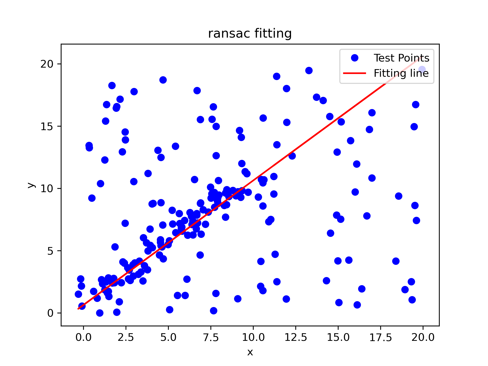

# A simple ransac example for line fitting.  

--- 
## 流程
1.获取样本数据sample、初始化inlier_num，模型的参数  
2.输入模型所需要的最小点数n，根据最小点数，随机在sample中选择n个数  
3.将n个数带入模型，计算当前条件下样本中的内点数量(比如拟合直线，则距离直线的垂直距离小于阈值的点为内点)  
4.若该次迭代的内点数m大于inlier_num，则令inlier_num=n，并更新模型参数，并计算iter数并更新，iter = log(1-P)*log(1-（inlier_num/total_size）**2)  
5.若inlier_num内点数满足内点数阈值，或迭代到最大数目，则停止，输出最优模型及参数  
可实时更新迭代的次数：公式为iter = log(1-P)*log(1-（inlier_num/total_size）**2)， 其中P为期望得到正确模型的概率，log等价于ln  

## 运行结果  

## Reference
- https://www.cnblogs.com/hansjorn/p/16804509.html
